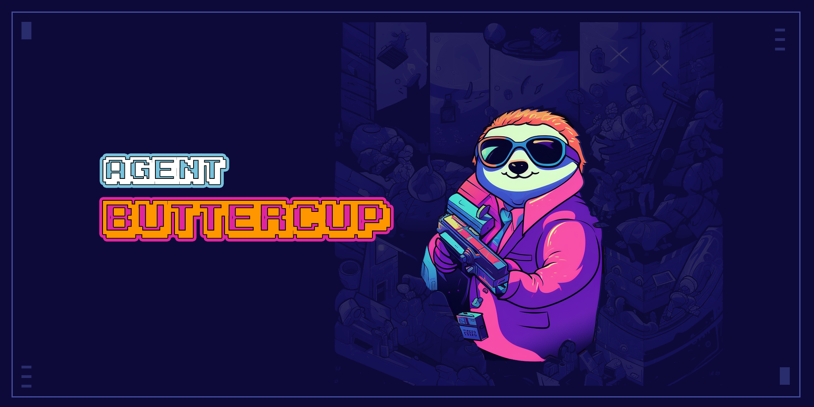

# What is Agent Buttercup?

Agent Buttercup is a flexible, Rust-based framework for conducting computationally-intensive, agent-based simulations in an EVM environment.

The simulation engine is built on top of [revm](https://github.com/bluealloy/revm), enabling fast EVM execution without any I/O overhead.
It was originally inspired by work done on [Arbiter](https://github.com/primitivefinance/arbiter), but ultimately took a very different approach to the design of the core simulation loop and agents.

## Why?

The simulation engine enables DeFi researchers/engineers to leverage a quantitative approach to:
- Evaluating the effects of new protocol mechanisms on market outcomes
- Optimizing risk settings, model parameters and incentives
- Stress-testing the robustness of a protocol against adversarial economic attacks and market environments

## High-Level Architecture

The core components of the simulation engine are as follows:

- **State**, an object which keeps track of:
1. EVM state inside a revm instance
2. Any non-EVM state inside a separate "World" object

- **Agents**, who in each step, decide what to do based on the current state and send transactions to update the EVM or world state.

- **Time Policy**, which determines how block numbers/timestamps progress in each step.

- **Summary Generators**, which compute summary statistics from state and write them to a file for analysis.

- **Manager**, the core object responsible for coordinating the state, agents, time policy and summarizers.
The manager effectively runs a loop. In each step:

1. Agents are processed in parallel across multiple threads and asked to send the manager any updates
2. Updates are executed against the EVM and world state
3. Update results (Did the EVM tx revert?, etc.) are sent back to the agents
4. Agents are given the ability to read state and update any local state they track
5. Summary generators are run and statistics are written to the file
6. The time policy is called and the EVM block number/timestamp are updated


## Repo Structure

The repo is set-up as a workspace with four crates:

- [`binder`](crates/binder): Tool for generating Rust bindings and some additional metadata from contract artifacts
- [`bindings`](crates/bindings): Rust contract bindings called inside the simulation
- [`simulate`](crates/simulate): Core logic of simulation engine
- [`simulations`](crates/simulations): Concrete implementations of the simulation engine for the Cozy protocol

## Installation

```
git clone https://github.com/Cozy-Finance/agent-buttercup
cd agent-buttercup
```

## Generating contract bindings

To interact with your smart contracts inside the simulation, you can generate Rust bindings from the artifacts.
To do so, use the [`binder`](crates/binder/main.rs) CLI:

```
cargo run --bin binder -- --abis <abis_path> --bindings <bindings_path>
```

Check out [`bind.sh`](bind.sh) for an example script which uses [forge](https://github.com/foundry-rs/foundry/tree/master/forge) to build a project and output bindings to [`crates/bindings`](crates/bindings).


## Usage

Setting up and running a simulation requires the following steps:

### Defining non-EVM state

The [`World`](crates/simulate/src/state/world.rs) trait object is a general data structure responsible for holding any non-EVM state which your agents need to access or update. 
`World` has an associated type `WorldUpdate`, which it takes as an input to its `execute` method.

A concrete example of what you may want to include here are CEX asset prices.
In that case, `WorldUpdate` could simply be a struct with a timestamp, asset and the new price.

In general, assuming your world is fairly complex, you will want `WorldUpdate` to be an enum with different variants for different world updates.
An example implementation of this design for the Cozy protocol is [here](crates/simulations/src/cozy/world.rs).

### Defining a time policy

The [`TimePolicy`](crates/simulate/src/time_policy.rs) trait object defines how block numbers and timestamps progress in the EVM.
A concrete implementation is responsible for:
1. Outputting a the new block number and timestamp on each simulation step.
2. Defining when it terminates (i.e. sufficient time or number of blocks have passed).

The `FixedBlockTimePolicy` implementation moves a fixed amount of time per step.


### Defining summary generators

The [`Summarizer`](crates/simulate/src/summarizer/mod.rs) and associated `SummaryGenerator` trait objects are responsible for computing metrics/statistics you want to collect from the EVM or world state on each step.

At the end of each step, all generators are run and the jsons are written to the `Summarizer`'s specified output file.
All generators must output a [`serde_json::Value`](https://docs.rs/serde_json/latest/serde_json/value/enum.Value.html).
Remember to register each generator you want to use with `summarizer.register_summary_generator(generator)`.

An example implementation for the Cozy protocol is [here](crates/simulations/src/cozy/summary_generators/).

### Defining agents

The [`Agent`](crates/simulate/src/agent/mod.rs) trait object defines an agent in the simulation.

The following methods define the core behavior of an agent which gets called on each step of the simulation:

1. `step`: Read EVM and world state, compute the actions you want to take and send updates to the manager for execution
2. `resolve_step`: Read state, receive results from update sent during `step` and potentially update your local state

There is also an `activation_step`, which is only called when the agent is first registered with the manager.
The activation step can be used to run any EVM or world set-up prior to the core simulation loop.

For example implementations of agents in the Cozy protocol, check [here](crates/simulations/src/cozy/agents/).

#### Sending updates

Note the signature of `step`:
```rust
fn step(&mut self, state: &State<U, W>, channel: AgentChannelSender<U>)
```
The agent only gets read-only access to the state. To execute actions against state, the agent sends updates to the manager for execution via the channel:

```rust
let token_approval_tx = token_contract.approve(
    approved_address,
    U256::MAX
);
let price_update = CexPrice::new(timestamp, price);

channel.execute_evm_tx(token_approval_tx);
channel.execute_world_update(price_update);
```

Note the signature of `resolve_step`:
```rust
fn step(&mut self, &mut self, state: &State<U, W>, channel: &AgentChannelReceiver<U>)
```
The agent can retrieve the results from evm and world updates executed during `step`.

```rust
let token_approval_result: bool = channel.receive_evm_tx_output()?;
let price_update_result = channel.receive_world_update_output()?;
```

Unlike `step` and `resolve_step`, the agent gets a mutable reference to state during `activation_step` and are free to mutate it as needed. They do not need to use a `channel` to send updates or retrieve results.
```rust
let token_approval = token_contract.approve(
    approved_address,
    U256::MAX
);
let token_approval_result: bool = state.execute_evm_tx_and_decode(
    self.address,
    token_approval
);
```

### Defining a manager and kicking off simulation loop

The [`Manager`](crates/simulate/src/manager.rs) is the key object responsible for running the simulation.  

Given a definition of `World`, `TimePolicy` and `Summarizer`, you can initiate the manager as follows:

```rust
let sim_state = SimState::new(world);
let sim_manager = SimManager::new(
    sim_state,
    Box::new(time_policy),
    summarizer
);
```

Next, you will want to activate all your agents:

```rust
for agent in agents {
    sim_manager.activate_agent(agent)?;
}
```

Note the order in which you activate agents also introduces an order on which the agent's `activation_steps` are run.

Finally, you can kick off your simulation:
```rust
sim_manager.run_sim()?;
```

An example of running simulations of the Cozy protocol is [here](crates/simulations/src/cozy/runner.rs).

### License

Agent Buttercup \
Copyright (C) 2023 Cozy Finance

This program is free software: you can redistribute it and/or modify it under the terms of the GNU Affero General Public License as published by the Free Software Foundation, either version 3 of the License, or (at your option) any later version.

This program is distributed in the hope that it will be useful, but WITHOUT ANY WARRANTY; without even the implied warranty of MERCHANTABILITY or FITNESS FOR A PARTICULAR PURPOSE.  See the GNU Affero General Public License for more details.

You should have received a copy of the GNU Affero General Public License along with this program.  If not, see <https://www.gnu.org/licenses/>.
